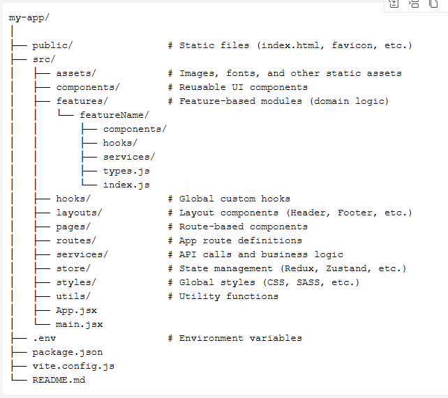
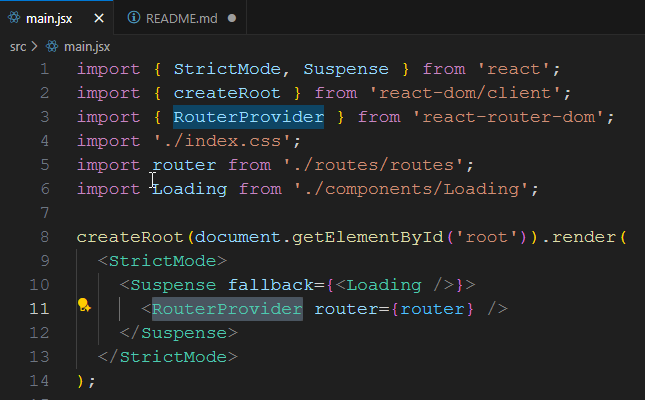
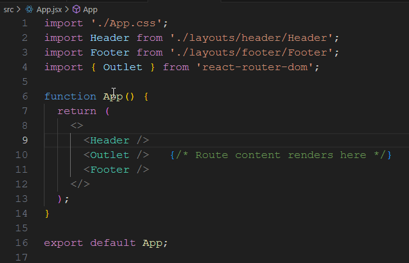

# React + Vite

This template provides a minimal setup to get React working in Vite with HMR and some ESLint rules.

Currently, two official plugins are available:

- [@vitejs/plugin-react](https://github.com/vitejs/vite-plugin-react/blob/main/packages/plugin-react) uses [Babel](https://babeljs.io/) for Fast Refresh
- [@vitejs/plugin-react-swc](https://github.com/vitejs/vite-plugin-react/blob/main/packages/plugin-react-swc) uses [SWC](https://swc.rs/) for Fast Refresh

## Expanding the ESLint configuration

If you are developing a production application, we recommend using TypeScript with type-aware lint rules enabled. Check out the [TS template](https://github.com/vitejs/vite/tree/main/packages/create-vite/template-react-ts) for information on how to integrate TypeScript and [`typescript-eslint`](https://typescript-eslint.io) in your project.


# Node instalation 
- Follow the steps here if it's not already installed in your machine https://nodejs.org/en/download

# Create a new React App by using Vite
Vite is a build tool that aims to provide a faster and leaner development experience for modern web projects

``` npm create vite@latest my-app -- --template react ```

# Configured the the project directory structure


# Configured the routes
```
npm install react-router-dom
```
### Step-1: Import the RouterProvider and modify the main.jsx as follows


### Step-2: Provide the outliet in the App componet and it will render the respectivice component on demand

### Step-3: Provide the links in the Header component
``` 
<div style={{ display: 'flex', gap: '2rem' }}>
    <Link to="/">Home</Link>
    <Link to="/about">About</Link>
    <Link to="/contact">Contact</Link>
</div> 
```
### Step-4: Run the following command at the root-directory of the project to run the tests 
```
npm run test
```
